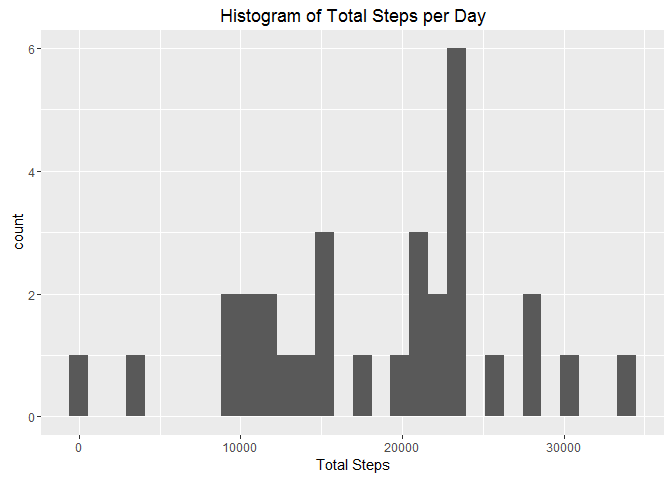
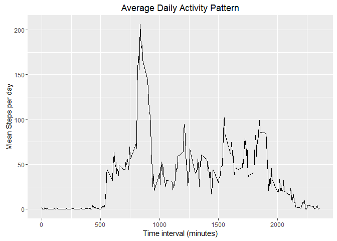
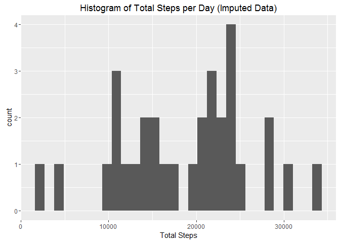
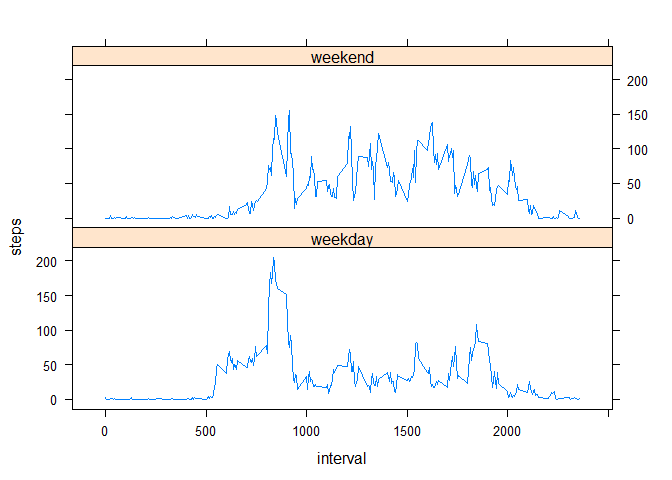

# Reproducible Research: Peer Assessment 1


## Loading and preprocessing the data

The data is contained in a zip file, unzip it and read in the data.


```r
RawData <- read.csv(unz("activity.zip", "activity.csv"))
```

Now load all the required packages

```r
library(dplyr)
```

```
## 
## Attaching package: 'dplyr'
```

```
## The following objects are masked from 'package:stats':
## 
##     filter, lag
```

```
## The following objects are masked from 'package:base':
## 
##     intersect, setdiff, setequal, union
```

```r
library(lubridate)
```

```
## 
## Attaching package: 'lubridate'
```

```
## The following object is masked from 'package:base':
## 
##     date
```

```r
library(ggplot2)
library(lattice)
```

## What is mean total number of steps taken per day?

Convert the date factors to a date variable

```r
RawData$date <- ymd(as.character(RawData$date))
str(RawData) #Check that the data type was converted
```

```
## 'data.frame':	17568 obs. of  3 variables:
##  $ steps   : int  NA NA NA NA NA NA NA NA NA NA ...
##  $ date    : Date, format: "2012-10-01" "2012-10-01" ...
##  $ interval: int  0 5 10 15 20 25 30 35 40 45 ...
```

Grab the data that we need to answer the question 'What is the mean total number of steps per day'. To accomplish this I group the data by day, and summed the number of steps each day. The result is stored in the variable *q2*.


```r
q2 <- RawData %>% group_by(day(date)) %>% summarize(steps = sum(steps, na.rm = TRUE))
names(q2) <- c("Day", "Total_Steps")
```

A code chunk below plots a histogram of the number off total steps taken each day.
 
 
 ```r
 p2 <- ggplot(q2, aes(Total_Steps))
 p2 <- p2 + geom_histogram() + labs(x = "Total Steps", title = "Histogram of Total Steps per Day")
 print(p2)
 ```
 
 ```
 ## `stat_bin()` using `bins = 30`. Pick better value with `binwidth`.
 ```
 
 <!-- -->
 
 ```r
 dev.off()
 ```
 
 ```
 ## null device 
 ##           1
 ```

The mean and median are calculated in the following code chuck


```r
print(paste("Mean Steps per day: ", mean(q2$Total_Steps)))
```

```
## [1] "Mean Steps per day:  18406.7096774194"
```

```r
print(paste("Median steps per day: ", median(q2$Total_Steps)))
```

```
## [1] "Median steps per day:  20525"
```


## What is the average daily activity pattern?

To generate the daily average activity pattern, we will group by time interval for each day, then compute the average steps for each interval.


```r
q3 <- RawData %>% group_by(interval) %>% summarize(steps = mean(steps, na.rm = TRUE))
```

Now plot the data


```r
p3 <- ggplot(q3, aes(interval, steps))
p3 <- p3 + geom_line() + labs(x = "Time interval (minutes)", y = "Mean Steps per day", title = 'Average Daily Activity Pattern')
print(p3)
```

<!-- -->

```r
dev.off()
```

```
## null device 
##           1
```

Which interval has the maximum number of steps each day on average.


```r
print(paste("Interval with the max average steps: ", q3$interval[which.max(q3$steps)]))
```

```
## [1] "Interval with the max average steps:  835"
```


## Imputing missing values

First we determine how many missing values there are in the dataset.

```r
print(sum(is.na(RawData$steps)))
```

```
## [1] 2304
```

To impute the missing values, I will assign a *NA* value with the median value for its time interval.


```r
#Calculate the median values
median_steps <- RawData %>% group_by(interval) %>% summarize(steps = median(steps, na.rm = TRUE))
q4 <- RawData
#loop over the dataframe and update the number of steps if the value is NA
for (i in 1:length(q4$steps)){
        if (is.na(q4$steps[i])){
                q4$steps[i] = median_steps[which(median_steps$interval == q4$interval[i]),2]
        }
}
#Change the steps from a list back to a vector
q4$steps <- unlist(q4$steps)
```

Generate the histogram for the total number of steps taken each day.

```r
q4b <- q4 %>% group_by(day(date)) %>% summarize(steps = sum(steps, na.rm = TRUE))
names(q4b) <- c("Day", "Total_Steps")

p4 <- ggplot(q4b, aes(Total_Steps))
p4 <- p4 + geom_histogram() + labs(x = "Total Steps", title = "Histogram of Total Steps per Day (Imputed Data)")
print(p4)
```

```
## `stat_bin()` using `bins = 30`. Pick better value with `binwidth`.
```

<!-- -->

```r
dev.off()
```

```
## null device 
##           1
```

The updated mean and median steps per day are:

```r
print(paste("Mean Steps per day: ", mean(q4b$Total_Steps)))
```

```
## [1] "Mean Steps per day:  18701.1612903226"
```

```r
print(paste("Median steps per day: ", median(q4b$Total_Steps)))
```

```
## [1] "Median steps per day:  20525"
```

Imputing the missing values using the median values caused the mean to increase and the median remained unchanged. 

## Are there differences in activity patterns between weekdays and weekends?

Add a new factor variable to the dataset

```r
q4 <- mutate(q4, day = ifelse(weekdays(q4$date) == "Sunday" | weekdays(q4$date) == "Saturday", "weekend", "weekday"))
```


```r
q5 <- q4 %>% group_by(day, interval) %>% summarize(steps = mean(steps, na.rm = TRUE))

#This time using lattice

with(q5, xyplot(steps~interval|day, type = "l", layout = c(1,2)))
```

<!-- -->
